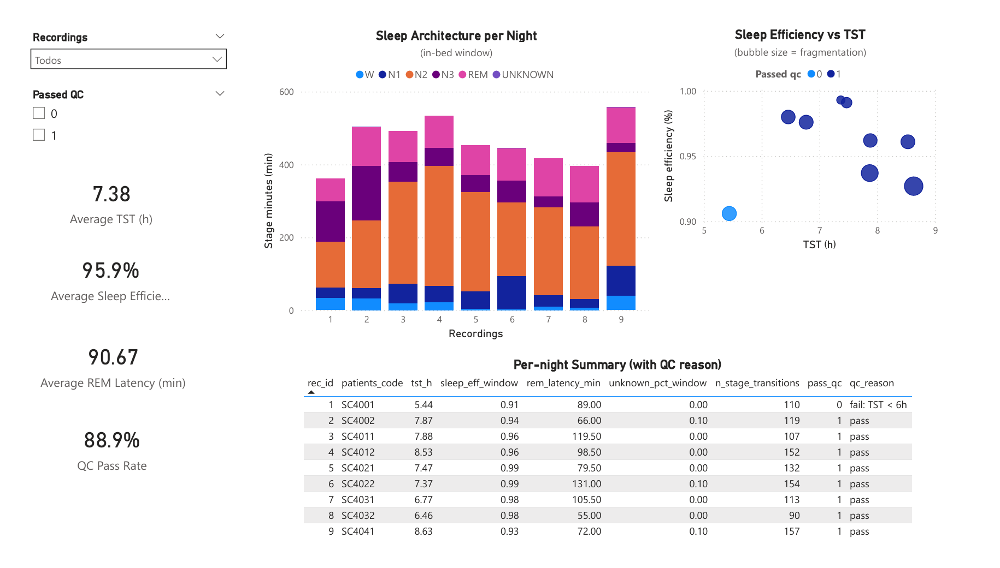

# SleepSQL (Sleep-EDF → SQLite) — Sleep Staging Mini Warehouse

This repo is a **learning / practice project** designed to build transferable SQL + data workflow skills (schema design, joins/aggregation, views, window functions, QA checks, exports to BI/Excel)

It uses **Sleep-EDF (PhysioNet)** sleep-stage annotations (hypnogram EDF files) to build an analysis-ready SQLite database.  
NOTE: Some fields may be synthetic (e.g., demographics and questionnaire-style flags)

---

## Project structure

- `data_raw/` — Sleep-EDF EDF files (kept out of git)
- `data_out/` — generated database and exported CSV artefacts for BI/Excel
- `etl/` — Python scripts (ETL + seeding)
- `sql/` — schema, indexes, views, queries, QA tests
- `docs/` — screenshots (ER diagram, Power BI, Excel dashboard)

---

## The database 

Tables created:
- **patients**    -> subjects/participants
- **recordings**  -> which night/recording/session
- **epochs**      -> 30-s slices per recording
- **notes**       -> “questionnaire” flags/notes per recording (coffee/alcohol/stress etc.)

NOTE: actual raw EEG samples are not stored in the database

Big Picture / Relationships
    - 1 patients → many recording (w no duplicate rec_code)
    - 1 recording → many epochs (w no duplicate epoch_idx)
    - 1 recording → 1 recording → 0 or 1 notes/questionnaire row
    - 1 epoch → optionally many QC flags

From these tables we build **views** that compute sleep metrics such as:
- sleep window / in-bed window
- TST (Total Sleep Time)
- sleep efficiency within the window
- stage minutes (N1/N2/N3/REM/W)
- REM latency
- fragmentation proxies (stage transitions, awakenings)


---

## Built with

- **SQLite**: lightweight relational database stored as a single `.db` file
- **sqlite3 CLI** (*command-line interface*): run schema/views/queries reproducibly
- **Python** ETL (*extract–transform–load*): reads Sleep-EDF annotations and loads tables
- **DBeaver** (interactive DB client + ER diagrams), **Power BI**, **Excel**

---

## Quickstart (end-to-end)

### 0) Requirements
- Python 3.11+
- SQLite (sqlite3)
- Recommended: conda environment (example):
  ```bash
  conda create -n sleep_sql python=3.11
  conda activate sleep_sql
  pip install mne pandas tqdm
  ```

### 1) Create tables + indexes
```bash
sqlite3 data_out/sleepedf_test.db ".read sql/schemas.sql"
sqlite3 data_out/sleepedf_test.db ".read sql/indexes.sql"
```

### 2) Load Sleep-EDF into the DB (ETL)
```bash
conda activate sleep_sql
python etl/01_extract_sleepedf.py
python etl/02_build_epochs.py
```

### 3) (Optional) Seed synthetic fields (for practice)
This fills missing demographics (age/sex/BMI) and questionnaire-style notes (0/1 flags) using a reproducible random seed
```bash
python etl/03_seed_synthetic.py
```

### 4) Create views and run QA tests
```bash
sqlite3 data_out/sleepedf_test.db ".read sql/views.sql"
sqlite3 -header -column data_out/sleepedf_test.db ".read sql/qa_tests.sql"
```

### 5) Run analysis queries
```bash
sqlite3 -header -column data_out/sleepedf_test.db ".read sql/queries.sql"
```

---

## Power BI / Excel exports

Three “BI-friendly” exports:

- `bi_nights.csv` — one row per recording/night (metrics + demographics + notes + derived QC)
- `bi_stage_minutes.csv` — one row per (night × stage), great for stacked bar charts
- `bi_fragmentation.csv` — fragmentation metrics (transitions, awakenings), normalised rates

---

## Power BI dashboard (one page)

**Tables**
- `bi_nights.csv` (main), `bi_stage_minutes.csv`, `bi_fragmentation.csv`

**Relationships**
- Join on `rec_id` 

**Visuals**
- KPI cards: Average TST (h), Average sleep efficiency (%), Average REM latency (min), QC pass rate (%)
- Stacked column chart: stage minutes per night (from bi_stage_minutes.csv)
- Scatter plot: TST vs sleep efficiency, bubble size = fragmentation proxy (awakenings/hour), colour = Passed QC (from bi_fragmentation.csv + bi_nights.csv)
- Table: per-night metrics + qc_reason + notes flags



NOTE: all metrics are calculated within the in-bed sleep window (from the first detected sleep epoch to the last detected sleep epoch)

---

## SQL skills practised 

**Core**
- SELECT / WHERE / ORDER BY
- JOINs (inner + left joins, anti-join checks)
- GROUP BY aggregates + cohort filtering logic
- CASE / NULL handling
- Normalised schema design (PK/FK, 1:many and 1:1 patterns)
- Indexes for performance

**Advanced / optional**
- CTEs (`WITH ...`)
- Window functions (`LAG`, `ROW_NUMBER`) for transitions and bout-style metrics
- Basic optimisation via `EXPLAIN QUERY PLAN`
- QA checks as repeatable tests (`sql/qa_tests.sql`)

---


